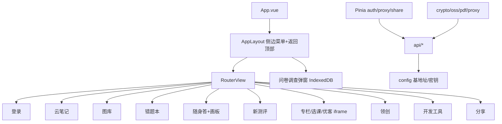

 dev

## 用户需求

将旧项目 `C:\Users\losho\ZhongYuToolbox` 中的 index 相关应用（单页 jQuery+Bootstrap 工具箱）用 Vue 3 + Element Plus 完整重写，原有功能全部保留，分多步逐步交付，每步可独立验证。

## 产品概述

中育 ToolBox 是一个面向中育账号用户的资源聚合工具箱 Web 应用，提供登录、云笔记、图库、错题本、随身答、新测评、在线专栏、选课、优客畅学、领创、下载应用、高级选项、开发工具、分享、问卷、公告等十余个功能模块。重写为 Vue 3 + Element Plus + Vite 工程，采用侧边导航 + 路由视图 + 弹窗的结构，保留全部业务能力。

## 核心功能（全部保留）

- 登录/用户中心：学校选择、token 校验与自动刷新、注销
- 云笔记：文件夹树/面包屑、全部笔记、搜索分页、PDF 转图片上传转存、下载
- 图库：正常/回收站分页、上传
- 错题本：学科筛选、题目列表、详情（题/答/解析/笔记/图片）
- 随身答：搜索+高级筛选、消息双栏预览、fabric 画板回复
- 新测评：列表分页、题目/概览/分析弹窗、分享
- 在线专栏/选课/优客畅学：iframe 嵌套渲染（含 MutationObserver 样式注入）
- 领创：设备绑定、应用列表、管理员密码计算器（MD5）
- 下载应用/下载加速/高级选项/说明致谢：静态页与 token 管理、课表、网阅联考
- 开发工具：OSS 多类型上传、题库上传
- 分享：创建分享、密码校验、按 hash 查看
- 全局：问卷调查弹窗（IndexedDB）、公告、本地代理探测、hash 路由恢复、返回顶部、懒加载

## 技术栈选型

- 框架：Vue 3（`<script setup>` + TypeScript）+ Vite
- UI 组件库：Element Plus（禁止使用 emoji 图标，统一使用 `@element-plus/icons-vue`）
- 状态管理：Pinia（auth、proxy、share 等全局状态）
- 路由：Vue Router（history 模式，侧边菜单对应路由，支持 hash 恢复）
- 第三方能力（保留原能力）：
  - `crypto-js`（AES-ECB 中育加密、AES-CBC 领创加密、MD5）
  - `ali-oss`（OSS 直传）
  - `fabric`（随身答画板回复）
  - `pdfjs-dist`（PDF 转图片上传）
  - `jszip`（zip 打包）
  - `sweetalert2` 或 ElMessage/ElMessageBox（通知提示）
  - `DPlayer`（在线专栏视频，如后续需要）
- 接口层：基于 `fetch` 封装的 `request` 工具，统一注入 `Authorization: Bearer <token>`

## 实现方案

采用「工程骨架先行 + 按模块逐步重写」的分批策略。先建立统一配置与基础设施（config、utils、request、pinia、router、布局、登录），将旧代码中散落的全局变量、密钥算法、API 地址集中到可配置模块；随后按依赖关系分批实现各功能页面/组件，每批可独立运行验证。

关键决策：

1. **统一配置模块** `src/config/index.ts`：集中 `API_BASE_URL`、`SHARE_SERVER`、`OSS` 配置、本地代理地址、学校选项、学科常量、AES 密钥生成函数。所有模块从此处读取，满足「利于后续统一修改」。
2. **复用旧算法**：将 `index.js` 中的 `aeskey()`/`aesEncrypt`/`aesDecrypt`、`proxyImgSrc`、`detectLocalProxy`，以及 `linspirer.js` 的 AES-CBC/JSON-RPC、`pdf-upload.js` 的 PDF 转图逻辑，原样迁移到 `src/utils/crypto.ts`、`src/utils/oss.ts`、`src/utils/pdf.ts` 等，保证行为一致。
3. **布局复用旧交互**：左侧 `el-menu` 折叠抽屉替代 Bootstrap offcanvas；tab 内容区改为 `<router-view>`；各 modal 改为 `el-dialog` 或独立组件。
4. **iframe 模块保留**：ZXZL/CK/lesson2 继续用 iframe + 脚本注入（CK 的 MutationObserver 原样保留在对应组件内）。
5. **逐项分批交付**：每批对应 1-3 个模块，避免一次性大改导致不可验证。

性能与可靠性：列表类（笔记搜索、随身答、错题本、测评）保留分页/懒加载；OSS 上传保留分片与进度；代理探测每 10s 轮询但用 `AbortController` 避免悬挂请求；图片统一走 `proxyImgSrc` 缓存。

## 实现注意事项

- 禁止 emoji 图标，所有图标使用 `@element-plus/icons-vue`。
- 旧代码 `window.xxx` 全局变量改为 Pinia store 或组件 `ref`，消除隐式依赖。
- 内联 `onclick="fn()"` 全部改为 Vue 事件绑定。
- 用户自测：不主动启动 dev server 或截图，交付后由用户浏览器验证。
- 密钥/算法必须 1:1 复刻，避免接口鉴权失败。

## 架构设计

采用分层架构：配置层（config）→ 工具层（utils/crypto、oss、pdf、proxy）→ 接口层（api/*）→ 状态层（stores）→ 视图层（views/模块页面 + components/共享组件）→ 布局层（AppLayout 含侧边菜单/返回顶部/问卷弹窗）。



## 目录结构

全新工程，列出将创建的核心文件：

```
ZhongYuToolBox_Rev/
├── index.html                      # [NEW] Vite 入口，挂载 #app，引入 Element Plus 样式
├── vite.config.ts                 # [NEW] Vite + Vue + TS 配置，别名 @ -> src
├── tsconfig.json                  # [NEW] TypeScript 配置
├── package.json                   # [NEW] 依赖：vue, element-plus, pinia, vue-router, crypto-js, ali-oss, fabric, pdfjs-dist, jszip
├── src/
│   ├── main.ts                    # [NEW] 应用入口，注册 Element Plus / Pinia / Router / icons
│   ├── App.vue                    # [NEW] 根组件，包含 AppLayout
│   ├── config/
│   │   └── index.ts               # [NEW] 统一配置：API_BASE_URL、SHARE_SERVER、proxy 地址、学校/学科常量、AES 密钥生成
│   ├── utils/
│   │   ├── crypto.ts              # [NEW] AES-ECB(中育)/AES-CBC(领创)/MD5，复刻旧算法
│   │   ├── request.ts             # [NEW] fetch 封装，注入 token，统一错误处理
│   │   ├── proxy.ts               # [NEW] detectLocalProxy + proxyImgSrc + proxyUrl
│   │   ├── oss.ts                 # [NEW] ali-oss 直传封装（多类型前缀）
│   │   └── pdf.ts                 # [NEW] PDF.js 转图片 + zip 打包（复刻 pdf-upload.js）
│   ├── api/
│   │   ├── auth.ts                # [NEW] 登录/刷新/token 校验
│   │   ├── note.ts                # [NEW] 云笔记接口
│   │   ├── picture.ts             # [NEW] 图库接口
│   │   ├── mistake.ts             # [NEW] 错题本接口
│   │   ├── quora.ts               # [NEW] 随身答接口
│   │   ├── exam.ts                # [NEW] 新测评接口
│   │   ├── linspirer.ts           # [NEW] 领创 JSON-RPC 接口
│   │   └── share.ts               # [NEW] 分享接口
│   ├── stores/
│   │   ├── auth.ts                # [NEW] 登录态、token、用户信息（替代 localStorage 散存）
│   │   ├── proxy.ts               # [NEW] 代理状态
│   │   └── share.ts               # [NEW] 分享状态
│   ├── layout/
│   │   ├── AppLayout.vue          # [NEW] 侧边菜单 + 顶部栏 + 返回顶部 + router-view
│   │   ├── SideMenu.vue           # [NEW] el-menu 菜单（替代 offcanvas）
│   │   └── SurveyModal.vue        # [NEW] 问卷调查弹窗（IndexedDB 状态）
│   ├── views/
│   │   ├── LoginView.vue          # [NEW] 登录/用户中心
│   │   ├── NoteView.vue           # [NEW] 云笔记（文件夹/全部/搜索/PDF上传）
│   │   ├── PictureView.vue        # [NEW] 图库
│   │   ├── MistakeView.vue        # [NEW] 错题本
│   │   ├── QuoraView.vue          # [NEW] 随身答列表+预览
│   │   ├── BoardDialog.vue        # [NEW] fabric 画板回复弹窗
│   │   ├── ExamView.vue           # [NEW] 新测评
│   │   ├── IframeViews.vue        # [NEW] 专栏/选课/优客（含 MutationObserver）
│   │   ├── LinspirerView.vue      # [NEW] 领创
│   │   ├── AppsView.vue           # [NEW] 下载应用/加速（静态）
│   │   ├── AdvanceView.vue        # [NEW] 高级选项
│   │   ├── DevelopView.vue        # [NEW] 开发工具 OSS 上传
│   │   ├── ShareView.vue          # [NEW] 分享创建/查看
│   │   └── AboutView.vue          # [NEW] 说明&致谢&更新日志
│   └── router/
│       └── index.ts               # [NEW] 路由表 + hash 恢复逻辑
```

## 关键代码结构（摘要）

- `src/config/index.ts`：导出 `API_BASE_URL`（默认 `https://zyapi.loshop.com.cn`，可由 localStorage 覆盖）、`SHARE_SERVER`、`PROXY_REMOTE`、`PROXY_LOCAL`、`SCHOOLS`、`SUBJECTS`、`generateAesKey()`。
- `src/utils/request.ts`：导出 `request(url, options)` 统一封装，自动附加 `Authorization` 与 JSON 解析，错误集中处理。
- `src/stores/auth.ts`：Pinia store，管理 `token/realName/photo/schoolCode/expired`，提供 `isLoggedIn`、`login()`、`logout()`、`startRefresh()`。

## 设计风格

采用现代化、清爽的后台工具箱风格，基于 Element Plus 默认主题做轻度品牌化定制。整体使用左侧可折叠深色侧边栏（替代原 Bootstrap offcanvas），主内容区为浅色卡片容器，背景保留原项目的模糊封面图氛围（通过半透明遮罩保证可读性）。

## 页面规划（核心页面，不超过 6 类结构）

1. 整体布局 AppLayout：顶部应用标题栏 + 左侧 el-menu 折叠菜单 + 右侧 router-view 内容区 + 返回顶部浮动按钮 + 全局问卷弹窗。
2. 登录页 LoginView：居中卡片，学校选择、账号/密码输入、登录按钮；已登录显示用户信息 + 注销。
3. 数据类页面（笔记/图库/错题本/随身答/测评）：统一使用 el-card 容器 + el-table/el-list 列表 + el-pagination 分页 + el-dialog 详情弹窗。
4. iframe 类页面（专栏/选课/优客）：全高 iframe 嵌入，选课页保留 MutationObserver 样式注入。
5. 领创/开发工具页：表单卡片 + 结果展示区。
6. 静态页（下载/高级/说明）：el-alert + 说明卡片 + 操作按钮。

## 交互与动效

- 侧边菜单折叠/展开带平滑过渡；列表 hover 高亮；el-dialog 淡入；返回顶部按钮滚动后出现并带淡入淡出；加载使用 el-skeleton / el-loading。
- 统一使用 Element Plus 图标（如 Menu、Upload、Picture、Document、Promotion 等），禁用 emoji。

## TODOS

- [X] 搭建 Vite+Vue3+TS+Element Plus 工程骨架与依赖
- [X] 创建 config 统一配置与 crypto/request/proxy/oss/pdf 工具（复刻旧算法）
- [X] 建立 Pinia stores 与 Vue Router（含 hash 恢复）
- [X] 实现 AppLayout 侧边菜单、返回顶部、问卷弹窗
- [X] 重写登录/用户中心模块
- [X] 重写云笔记模块（文件夹/搜索/PDF上传）
- [X] 重写图库模块（正常/回收站/上传）
- [X] 重写错题本模块（筛选/列表/详情）
- [X] 重写随身答模块与 fabric 画板回复
- [X] 重写新测评模块（列表分页/题目弹窗/概览弹窗/题目分析弹窗/导出客观题答案；分享按钮暂接"分享模块后续接入"提示）
- [X] 重写专栏/选课/优客 iframe 页（含样式注入）
- [X] 重写领创模块（绑定/应用/密码计算器）
- [X] 重写下载应用/加速/高级选项/说明致谢/开发工具/分享模块
- [X] 全局联调与代理探测/路由/问卷收尾验证
